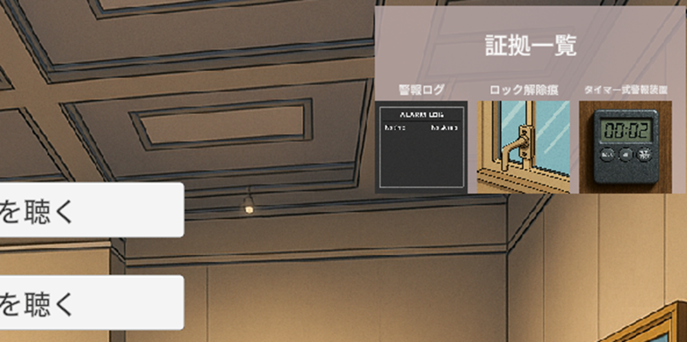

# StolenVase

[ゲームのサンプルプレイ](https://ando-33.github.io/StolenVase_web/)


## 制作のポイント
### 証拠一覧パネルの作成
Playerが事件の犯人を特定するヒントとなる証拠一覧を右上にパネルを用意し、いつでもクリックして確認できるようにしました。



## キャラクター画像の切り替え
Playerの行動で相手のキャラクターが動揺する画像に切り替わる工夫をしました。

```C#
IEnumerator CorrectEvidenceFlow()
{
    ShowLeftCharacter("探偵", "防犯システムの記録では、該当時刻に“警報作動なし”。あなたが聞いたのは何の音ですか？");
    yield return WaitForClick();

    // 🔽 ここで動揺した画像に切り替わる
    ShowRightCharacter(guardNervous, "警備員", "な、なに？そんなはずは……！でも確かに音がしたんだ。展示室に私が着いた時には警報は止まっていたが。");
    yield return WaitForClick();

    yield return StartCoroutine(Start_B_OuterClaim());
}
void ShowRightCharacter(Sprite sprite, string speaker, string text)
{
    nameText.text = speaker;
    dialogueText.text = text;
    if (characterLeft) characterLeft.enabled = false;
    if (characterRight)
    {
        characterRight.enabled = true;
        characterRight.sprite = sprite;
    }
}
```
